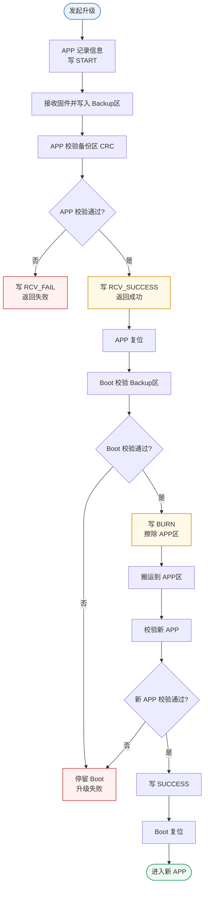
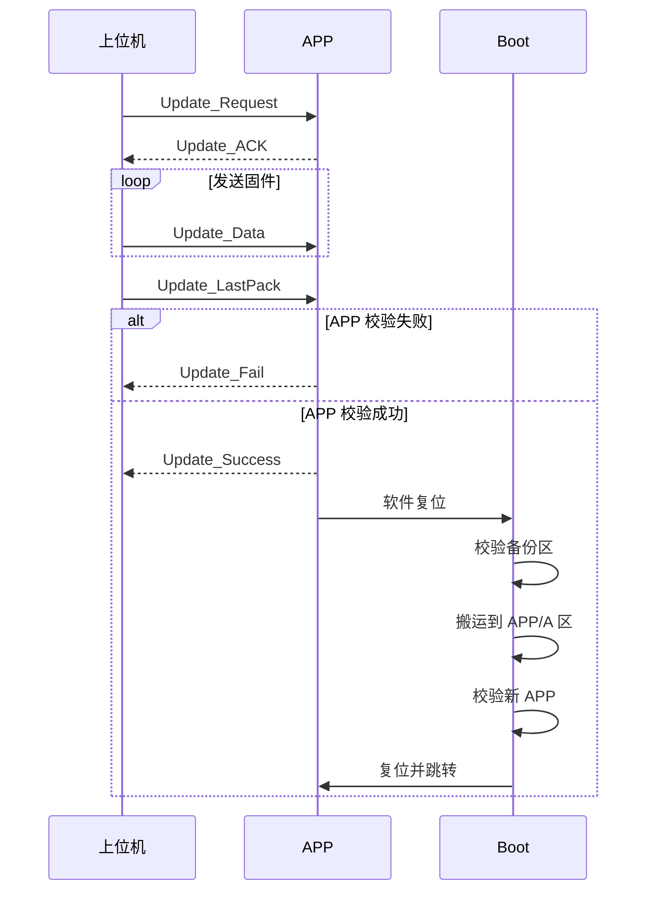

# 通讯板固件升级流程说明

## 1. 硬件平台与 Flash 扇区划分

**主控芯片**：STM32F446 系列  
**Flash 总容量**：512 KB  
**扇区数量**：8 个

| 扇区   | 地址范围 (起始 - 结束) | 大小    |
|:------:|:----------------------|:-------:|
| 扇区 0 | `0x0800 0000` - `0x0800 3FFF` | 16 KB   |
| 扇区 1 | `0x0800 4000` - `0x0800 7FFF` | 16 KB   |
| 扇区 2 | `0x0800 8000` - `0x0800 BFFF` | 16 KB   |
| 扇区 3 | `0x0800 C000` - `0x0800 FFFF` | 16 KB   |
| 扇区 4 | `0x0801 0000` - `0x0801 FFFF` | 64 KB   |
| 扇区 5 | `0x0802 0000` - `0x0803 FFFF` | 128 KB  |
| 扇区 6 | `0x0804 0000` - `0x0805 FFFF` | 128 KB  |
| 扇区 7 | `0x0806 0000` - `0x0807 FFFF` | 128 KB  |

---

## 2. Flash 分区方案

| 分区名称           | 起始地址                     | 大小     | 占用扇区       | 功能说明                                 |
|:------------------|:----------------------------|:--------:|:--------------|:-----------------------------------------|
| **Bootloader 区** | `0x0800 0000` - `0x0800 7FFF` | 32 KB    | 扇区 0 + 扇区 1 | 存放启动引导、升级控制与验证逻辑         |
| **配置 / 标志区**   | `0x0800 8000` - `0x0800 BFFF` | 16 KB    | 扇区 2         | 存储关键标志位（版本号、升级状态、校验值）|
| **应用程序区**       | `0x0800 C000` - `0x0803 FFFF` | 208 KB   | 扇区 3+4+5     | 正常运行的应用固件                  |
| **程序备份区**       | `0x0804 0000` - `0x0807 7FFF` | 256 KB   | 扇区 6+7       | 新固件下载与缓存区                      |

---

## 3.方案概述

这套 IAP 是两阶段升级：

1. `APP` 负责接收上位机固件，并写入 `Backup区`
2. `APP` 本地校验通过后写升级标志并复位
3. `Boot` 启动后读取标志
4. `Boot` 校验 `Backup`
5. `Boot` 把备份区搬运到 `APP`
6. `Boot` 再校验 `APP`
7. 成功后复位并跳转新 `APP`

核心目的：

- 通信阶段不破坏当前运行程序
- 真正覆盖运行区时交给 `Boot`
- 借助 `标志区 + 备份区` 提高掉电恢复能力

## 4. 核心流程



## 5. 时序


## 6. 异常处理

### 6.1 APP 接收中断电

- 只要还没到 `RCV_SUCCESS`
- Boot 下次启动不会搬运
- 旧 APP 仍可继续运行

### 6.2 APP 已校验成功后断电

- 只要标志已写成 `RCV_SUCCESS`
- 下次上电 Boot 会继续升级流程

### 6.3 Boot 搬运中断电

- 只要标志已写成 `BURN`
- 下次上电 Boot 会继续校验并搬运

### 6.4 APP 校验失败

- 返回 `Update_Fail`
- 标志写为 `RCV_FAIL`
- 保留旧 APP

### 6.5 Boot 校验或搬运失败

- 标志写失败态
- 停留在 Boot
- 不跳入未知 APP

## 7. 关键约束

- 升级文件大小不能超过 `0x34000`
- 当前 Boot 搬运已按向上取整写入，支持文件大小非 4 字节对齐
- 文件完整性以 `CRC32` 为准

---

## IAP协议帧格式介绍  

### 1. 概述

本协议在电机透传帧格式基础上兼容改造，适用于固件升级（IAP）协议帧采用固定顺序的字段排列，无额外填充字节，保证在嵌入式系统与上位机之间高效、可靠地传输数据。

```c
// 协议帧结构体（按实际字节顺序排列）
typedef struct 
{
    unsigned char    header;                 /* 协议头 */
    unsigned short   cmd;                    /* 指令码 */
    unsigned int     packnum;                /* 数据包号 */
    unsigned short   len;                    /* 数据长度 */
    unsigned char    data[UPDATA_LEN];       /* 数据 */
    unsigned int     checksum;               /* 校验和 */
    unsigned char    footer;                 /* 协议尾 */
} IAPStruct;
```

### 2. 帧格式总览

| 偏移 (byte) | 字段名   | 数据类型            | 长度 (byte) | 说明                                             |
|:----------:|:---------|:--------------------|:----------:|:-------------------------------------------------|
|     0      | header   | unsigned char       |     1      | 协议头 (`0xAA`)，用于帧起始同步                   |
|    1-2     | cmd      | unsigned short      |     2      | 指令码，表示操作类型                              |
|    3-6     | packnum  | unsigned int        |     4      | 数据包序号，用于顺序控制与重传                    |
|    7-8     | len      | unsigned short      |     2      | 数据字段的有效长度（字节数）                      |
|    9-62    | data     | unsigned char[54]   |     54     | 负载数据，最大长度由 `len` 定义，不足剩余部分填充 `0xFF` |
|   63-66    | checksum | unsigned int        |     4      | 校验和，覆盖除自身和帧尾外的整个帧                |
|    67      | footer   | unsigned char       |     1      | 协议尾 (`0xBB`)，用于帧结束同步                   |

### 3. 指令码 (cmd)

字节序：小端模式（低位字节在前，高位字节在后）

```c
typedef enum
{
    Update_Request  = 0xff,   /* 升级请求，进入升级状态 */
    Update_Data     = 0xfe,   /* 数据包，写入 flash（满 512 字节后执行写入） */
    Update_LastPack = 0xfd,   /* 最后一包数据，校验后返回成功或失败 */
    Update_Success  = 0xfc,   /* 返回升级成功 */
    Update_Fail     = 0xfb,   /* 返回升级失败 */
} UPDATA_CMD;
```

| 指令值 | 宏名称          | 方向           | 说明                                                              |
|--------|-----------------|----------------|------------------------------------------------------------------|
| 0xFF   | Update_Request  | 上位机 → 设备  | 升级请求，通知设备进入 IAP 升级状态                                |
| 0xFE   | Update_Data     | 上位机 → 设备  | （建立握手后）传输升级文件数据包                                   |
| 0xFD   | Update_LastPack | 上位机 → 设备  | 最后一包数据，设备收到后对整个固件校验，返回成功/失败                |
| 0xFC   | Update_Success  | 设备 → 上位机  | 设备返回升级成功确认                                               |
| 0xFB   | Update_Fail     | 设备 → 上位机  | 设备返回升级失败确认                                               |
| 0xFA   | Update_ACK      | 设备 → 上位机  | 设备对 `Update_Request` 的握手应答                                 |

> **注**：`xxx` 表示该区域全部填充 `0xFF`

## 4. 填充规则与特殊传输机制

### 无效数据填充

除 `0xFE` `0xFF`（Update_Data/Update_Request）指令外，其余指令帧的 `packnum` 到 `data` 字段（即偏移 3~62）全部填充 `0xFF`  
示例（`Update_Request` 帧）：

```text
0xAA 0xFF xxxx...Data checksum 0xBB
↑    ↑     ← 3~62 →    ↑63-66  ↑67
```

### Update_Request(FF)数据段(data)内容格式

```text  
   - 0-4byte   file_CRC32 整个文件的检验
   - 5-8byte   file_Size  整个文件有效数据的字节总数
   - 9-12byte  Software_version  软件版本
   - 13-16byte Hardware_version  硬件版本  
```

### SPI 主从滞后与额外全 0xFF 帧

由于 SPI 主从数据传输特性，上位机收到的从机回包天然滞后一个传输周期。因此上位机发送完指令后，需额外发送一帧（整帧 68 字节全 0xFF）以读取从机应答

## 通信示例

### 升级请求与握手

```text
上位机发送 Update_Request:  0xAA 0xFF... ... ... checksum 0xBB
上位机再发送 (全0xFF帧):    0xFF 0xFF 0xFF...0xFF 0xFF     0xFF
设备 → 上位机 Update_ACK:   0xAA 0xFA xxxx...xxxx checksum 0xBB
```

### 最后一包数据确认

```text
上位机发送 Update_LastPack: 0xAA 0xFD packnum len data checksum 0xBB
上位机再发送 (全0xFF帧):    0xFF 0xFF 0xFF.......0xFF 0xFF 0xFF
设备 → 上位机 
  升级成功:  0xAA 0xFC xxxx...xxxx checksum 0xBB
  升级失败:  0xAA 0xFB xxxx...xxxx checksum 0xBB
```
